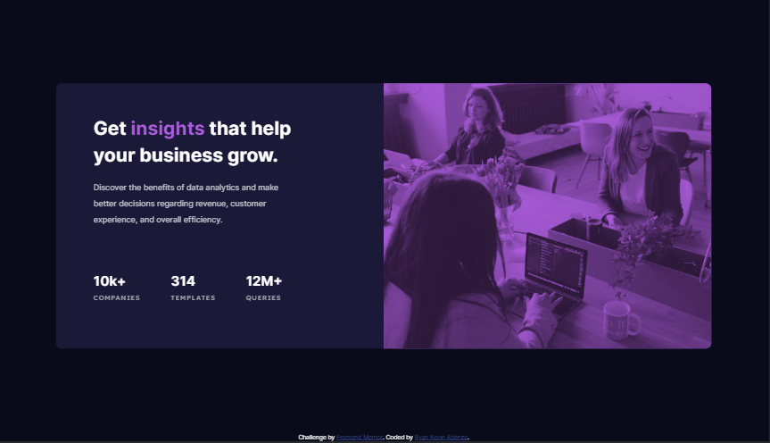

# Frontend Mentor - Stats preview card component solution

This is a solution to the [Stats preview card component challenge on Frontend Mentor](https://www.frontendmentor.io/challenges/stats-preview-card-component-8JqbgoU62). Frontend Mentor challenges help you improve your coding skills by building realistic projects. 

## Table of contents

- [Overview](#overview)
  - [The challenge](#the-challenge)
  - [Screenshots](#screenshots)
  - [Links](#links)
- [My process](#my-process)
  - [Built with](#built-with)
  - [What I learned](#what-i-learned)
  - [Continued development](#continued-development)
  - [Useful resources](#useful-resources)
- [Author](#author)

## Overview

### The challenge

Users should be able to:

- View the optimal layout depending on their device's screen size

### Screenshots

### Links

- Solution URL: [Add solution URL here](https://your-solution-url.com)
- Live Site URL: [Add live site URL here](https://your-live-site-url.com)

## My process

### Built with

- Semantic HTML5 markup
- CSS custom properties
- Flexbox
- Mobile-first workflow
- SASS

### What I learned

With this challenge I tried to do a more top-down approach, starting with bigger, global styles and working my way down to the finer details. It definitely gave the styling process some structure, and I didn't feel as lost. Big takeaways for me is that organization and having structure is very important.

When figuring out how to give the header image a purple tint, I discovered that CSS allows for blend modes! This allowed me to have the image multiply over a purple background. My prior experience with digital painting software helped me figure this out. Discovering this feature was pretty exciting for me.

I also learned about the difference between inline and block display while working on the header image. I was a bit stumped when I could not figure out where the extra whitespace underneath the image was coming from until I found out that the default inline display adds line height to the image.

### Continued development

I found myself relying on flexbox a lot in this project. I realize that I could have made the container for the information much simpler with a 3x3 CSS grid since my approach made use of nested flexboxes. In the future, I'll make sure to use a combination of both containers when appropriate to reduce the amount of nesting I need to do and to make styling easier.

### Useful resources

- [Flexbox Reference](https://css-tricks.com/snippets/css/a-guide-to-flexbox/) - Incredibly useful resource for building a flexbox. I referenced this often as I worked on the challenge.
- [Mozilla Developer Docs](https://developer.mozilla.org/en-US/docs/Web/CSS/mix-blend-mode) - Where I found out that CSS supports blend modes!
- [Article on Extra Whitespace Underneath Images](https://www.tutorialrepublic.com/faq/how-to-remove-white-space-under-an-image-using-css.php) - A short and sweet article explaining that  elements are displayed inline by default.

## Author

- Website - [Ryan Atienza Portfolio Site](https://ryankpa.github.io/)
- Frontend Mentor - [@ryankpa](https://www.frontendmentor.io/profile/ryankpa)